# file-system
同济大学CS《操作系统》课程设计: 文件系统TongJi University CS OS assignment: file system
## 概述

本项目是为2021年同济大学计算机系操作系统课程设计。实现了类UNIX文件系统。

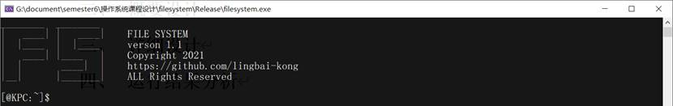

### 功能

1. 具有高速缓存
2. 实现了多用户多用户组的管理和访问权限控制
3. 实现了一个简单的控制台编辑器，可以直接在文件系统内对文本文件进行编辑

### 快速开始

1. 打开文件系统.exe
2. 输入help命令查看可用命令
3. 输入命令login root登录系统，初始密码为root

### 重要注意事项

1. 退出程序时禁止直接关闭程序，必须使用exit命令退出文件系统，否则可能导致文件系统错误或崩溃
2. 慎重修改/etc/users.txt和/etc/groups.txt文件，这两个文件与用户管理相关，如果修改格式不当可能会导致文件系统无法登录或其他权限问题
3. 如果以上两条问题发生请尝试格式化文件系统

## 备注:star:

本学期最简单的大作业（主要是没有GUI），开发该文件系统耗时10天

如果本仓库有帮助到你，就送我一颗star吧🤗

如果有问题也可以在issue提出，方便其他人参考或一起讨论😋

仓库遵循MIT开源协议

## 设计

### 重点函数变量说明

#### 文件索引相关函数中的length变量

这个变量主要用于记录当前读到的文件长度，这个变量的存在降低了文件混合索引的难度。函数不需要实现计算好该文件用了多少个索引块，也不需要实现知道文件的混合索引结构是怎样的，直接将索引文件一律看作是用满了所有索引块的达到最大大小的巨型文件。从直接索引开始遍历文件，再到一级索引，再到二级索引，当length达到了文件的大小直接退出遍历即可完成对任意大小文件的遍历。但这种方法的缺点是每一次读文件都要从文件头开始，降低了随机读写的效率。

#### 编辑器显示函数start_line变量

这个变量主要用于指示编辑器从哪一行开始显示文本，当文件行数超过了控制台高度时这个变量开始生效。控制台光标在控制台中的行数映射到实际文本的行数要加上start_line这个变量。当光标移动到最下面一行时再次按下方向键下，start_line会加一实现文本在编辑器内的向下翻页，向上翻页反之亦然。

#### 命令行用户界面cur_dir变量

这个变量属于命令行用户界面类，主要记录了用户处在文件系统中的路径。因为在文件系统中，所有操作接口都是以绝对路径为基准的，而用户在命令行界面下输入的命令是以cur_dir这个相对路径作为基准的。因此用户界面在使用文件系统的接口时要将cur_dir与用户输入的路径进行拼接，把绝对路径作为参数传入文静系统的接口函数。

### 模块调用关系

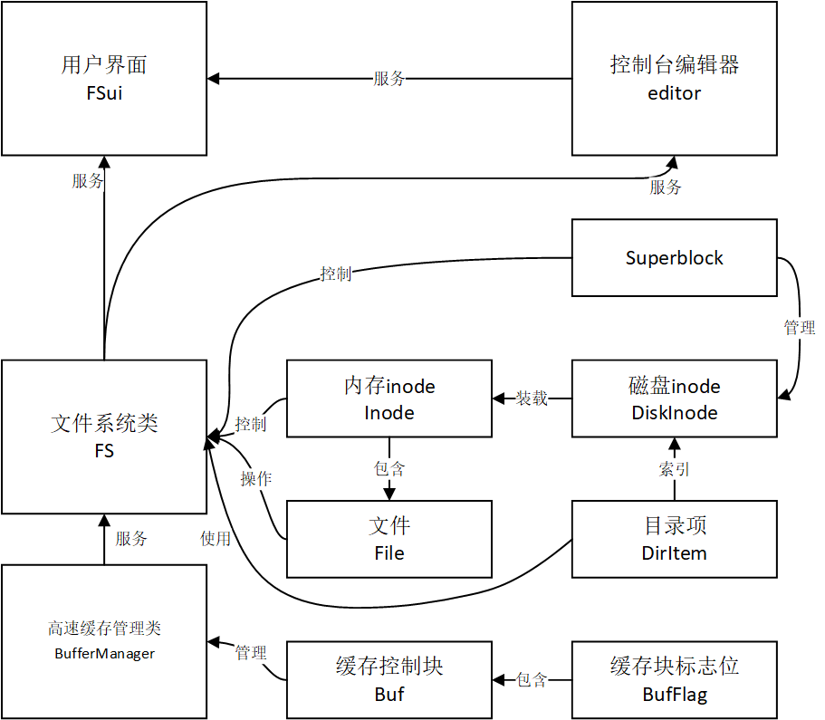

### 函数调用关系

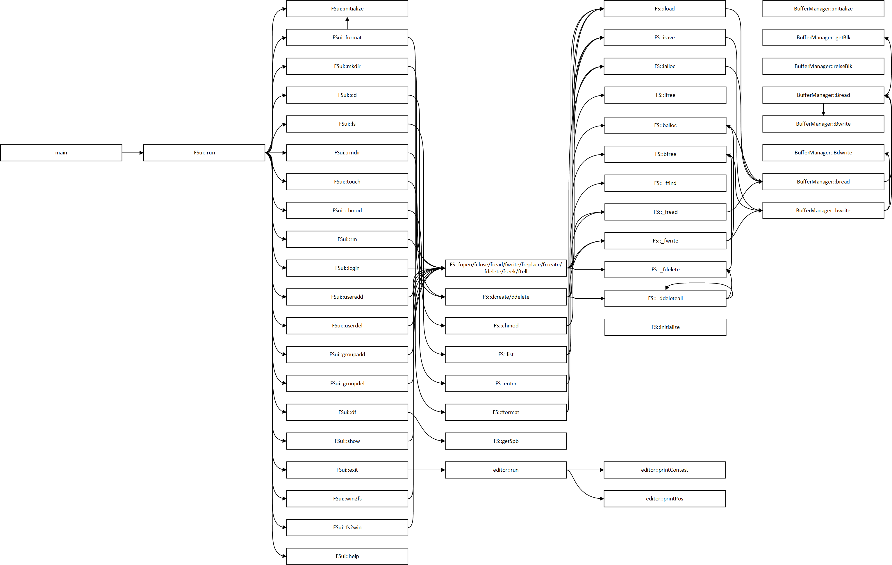

## 用户使用说明

### 运行环境

本文件系统运行与64位Windows操作系统下，文件系统的模拟文件卷大小为128MB，请确保程序目录下有足够的可用空间。

### 重要注意事项

1. 退出程序时禁止直接关闭程序，必须使用exit命令退出文件系统，否则可能导致文件系统错误或崩溃。

2. 慎重修改/etc/users.txt和/etc/groups.txt文件，这两个文件与用户管理相关，如果修改格式不当可能会导致文件系统无法登录或其他权限问题。

如果以上两条问题发生请尝试格式化文件系统。

### 使用命令说明

未登录状态下可用命令：

| 命令   | 参数             | 功能             |
| ------ | ---------------- | ---------------- |
| login  | 用户名（字符串） | 用户登录         |
| exit   |                  | 退出系统         |
| format |                  | 格式化文件系统   |
| help   |                  | 显示命令提示清单 |

登录状态下可用命令：

| 命令     | 参数                                                         | 功能                                         |
| -------- | ------------------------------------------------------------ | -------------------------------------------- |
| logout   |                                                              | 用户注销                                     |
| exit     |                                                              | 退出系统                                     |
| mkdir    | 目录名（字符串，长度小于28字节，不能是多级目录）             | 创建子目录                                   |
| cd       | 目录名（字符串，长度小于28字节，当前目录下的子目录名，不能是多级目录） | 进入子目录                                   |
| ls       |                                                              | 显示当前目录清单                             |
| rmdir    | 目录名（字符串，长度小于28字节，当前目录下的子目录名，不能是多级目录） | 删除子目录                                   |
| touch    | 文件名（字符串，长度小于28字节，不能是多级目录）             | 创建新文件                                   |
| chmod    | 文件名（字符串，长度小于28字节，当前目录下的文件名，不能是多级目录） 权限（三位八进制数） | 修改文件或目录权限                           |
| rm       | 文件名（字符串，长度小于28字节，当前目录下的文件名，不能是多级目录） | 删除文件                                     |
| useradd  | 用户名（字符串） 用户组名（字符串，用户组必须已存在）        | 添加用户                                     |
| userdel  | 用户名（字符串，用户必须已存在）                             | 删除用户                                     |
| groupadd | 用户组名（字符串）                                           | 添加用户组                                   |
| groupdel | 用户组名（字符串，用户组必须已存在）                         | 删除用户组                                   |
| df       |                                                              | 查看磁盘使用情况                             |
| show     | 文件名（字符串，长度小于28字节，当前目录下的文件名，不能是多级目录） | 打印文件内容。如果文件不是字符文件可能会出错 |
| vi       | 文件名（字符串，长度小于28字节，当前目录下的文件名，不能是多级目录） | 用编辑器打开文件                             |
| format   |                                                              | 格式化文件系统                               |
| win2fs   | Windows下的文件路径（字符串，符合Windows文件路径规范） FS文件系统当前目录下的文件名（字符串，长度小于28字节，当前目录下的文件名，不能是多级目录） | 将Windows文件内容复制到FS文件系统文件        |
| fs2win   | FS文件系统当前目录下的文件名（字符串，长度小于28字节，当前目录下的文件名，不能是多级目录） Windows下的文件路径（字符串，符合Windows文件路径规范） | 将FS文件系统文件内容复制到Windows文件        |
| cls      |                                                              | 清屏                                         |
| help     |                                                              | 显示命令提示清单                             |

编辑器使用说明：

进入编辑器后可以通过方向键移动光标，当光标位于上下边界时，可以再次令光标向边界处移动完成文本内容的翻页，输入回车键删除光标前的字符，输入其他字符在光标处插入字符，按下esc键退出并保存文本。编辑器中的“□”表示回车键，“#”表示文件结尾。注意编辑器仅能够处理ASCII字符。

### 异常说明

程序可能因为命令输入不当、文件系统空间用满、非法权限等原因导致各种异常，发生异常时程序会将异常信息输出到控制台，请根据输出信息解决异常。如果始终无法解决异常请尝试将文件系统格式化。

### 可调参数说明

可调参数位于filesystem.h文件中的宏定义

| 参数      | 说明                                                         |
| --------- | ------------------------------------------------------------ |
| VERSION   | 文件系统版本                                                 |
| DISK_NAME | 模拟文件卷文件名                                             |
| DISK_SIZE | 文件卷磁盘大小，至少大于1024*512个字节，建议设置为(261120+1024) *512个字节即128MB |

### 源代码文件说明

| 文件名         | 说明                                                         |
| -------------- | ------------------------------------------------------------ |
| filesystem.h   | 文件系统头文件                                               |
| filesystem.cpp | 文件系统C++文件                                              |
| main.cpp       | 主程序C++文件（命令行用户界面）                              |
| test.cpp       | 对文件系统文件接口的测试文件，没有将该文件编译到最终的可执行程序 |
| FS.data        | 模拟磁盘文件卷                                               |
| 文件系统.exe   | 可执行程序（命令行用户界面）                                 |

### 磁盘卷初始内容

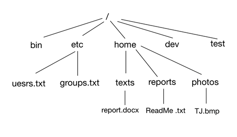

## 附录

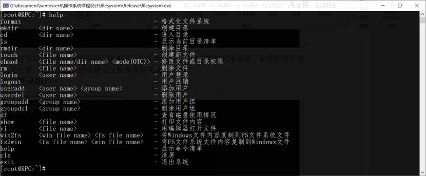

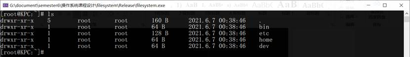

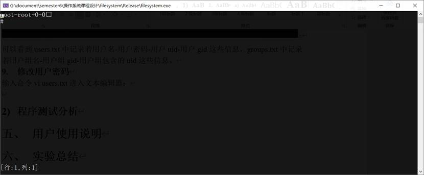

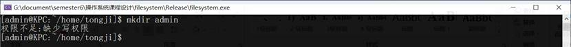

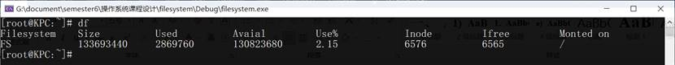

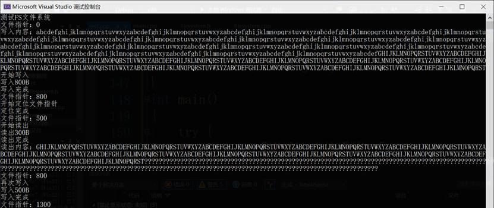

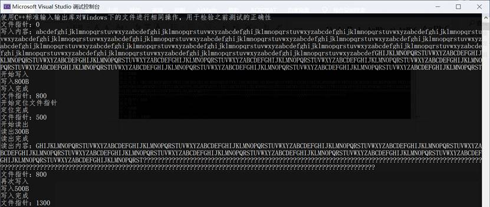

